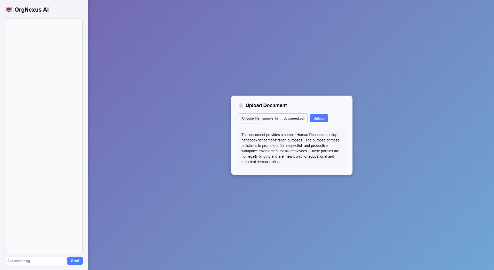

# OrgNexus AI 🤖

OrgNexus AI is an intelligent chatbot designed for large organizations to assist employees with internal queries such as HR policies, IT support information, and organizational guidelines.

The system uses Natural Language Processing (NLP) and document processing techniques to understand user queries and provide relevant responses.

In addition to answering questions, OrgNexus AI can analyze uploaded documents and generate concise summaries, helping employees quickly understand important policy documents.

---

## 🚀 Features

- 💬 **AI Chatbot Interface**  
  Allows employees to ask questions related to HR policies, IT support, and organizational information.

- 📄 **Document Upload & Summarization**  
  Users can upload PDF documents (8–10 pages) and the chatbot extracts text and provides a summarized version.

- 🧠 **Natural Language Processing (NLP)**  
  Uses NLP techniques to understand different variations of employee queries.

- ⚡ **Fast Response Time**  
  Designed to respond within 5 seconds for most queries.

- 🎨 **Modern User Interface**  
  Clean web interface with chat panel and document analysis panel.

- 🔐 **Scalable Architecture**  
  The system is designed to support multiple users simultaneously.

- 🚫 **Language Filtering**  
  Detects and filters inappropriate or abusive language.

---

## 🛠️ Technologies Used

### Backend
- Python
- Flask
- SpaCy / Transformers
- PyPDF2

### Frontend
- HTML
- CSS
- JavaScript

### Tools
- Git
- GitHub

---

## 📂 Project Structure

```
OrgNexus
│
├── app.py
├── backend
│   ├── chatbot_engine.py
│   └── document_processor.py
│
├── data
│   └── knowledge_base.json
│
├── templates
│   └── index.html
│
├── static
│   └── style.css
│
└── README.md
```

---

## ⚙️ Installation & Setup

### 1. Clone the repository

```
git clone https://github.com/yourusername/OrgNexus.git
cd OrgNexus
```

### 2. Install dependencies

```
pip install flask
pip install spacy
pip install PyPDF2
pip install transformers
pip install torch
```

### 3. Run the application

```
python app.py
```

### 4. Open in browser

```
http://127.0.0.1:5000
```

---

## 📌 Example Queries

Employees can ask questions like:

- What is the leave policy?
- How many sick leaves do employees get?
- Explain IT usage policy.
- What benefits do employees receive?

---

## 📄 Document Processing

Users can upload a PDF document and the chatbot will:

1. Extract the text from the document
2. Analyze the content
3. Generate a summarized version

---

## 🎯 Future Improvements

- Email OTP based **2-Factor Authentication**
- Multi-user session support
- Admin dashboard for chatbot monitoring
- Advanced document question answering
- Integration with enterprise databases

---

## 👨‍💻 Author

Developed as an AI-based chatbot system for organizational knowledge assistance.

---

## 👨‍💻 Output


---

## 📜 License

This project is created for educational and research purposes.
